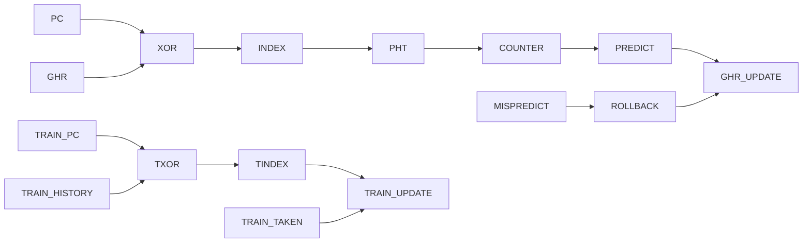
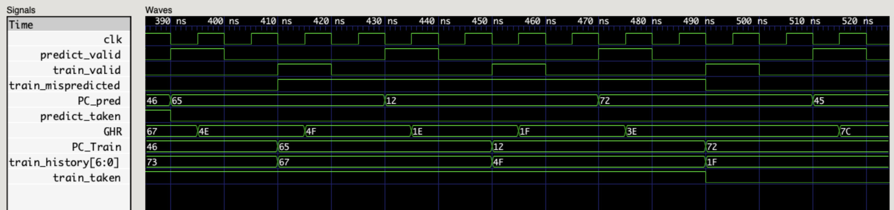

# GShare Branch Predictor (Verilog)

A Verilog implementation of a GShare branch direction predictor
featuring a global history register, pattern history table, and 2-bit
saturating counters.\
The design models a dynamic branch prediction mechanism commonly used in
pipelined processors.

------------------------------------------------------------------------

## Features

-   7-bit Global History Register (GHR)
-   128-entry Pattern History Table (PHT)
-   2-bit saturating counters
-   Speculative history updates during prediction
-   Misprediction rollback support

------------------------------------------------------------------------

## Architecture (GShare)

------------------------------------------------------------------------

## High-Level Operation

-   Indexing: `index = PC XOR GHR`
-   Prediction: MSB of selected PHT counter determines branch direction
-   Training: Counter increments/decrements based on actual outcome
-   Recovery: On misprediction, GHR is restored using stored history

------------------------------------------------------------------------

## Repository Structure

rtl/ RTL design (Verilog)\
tb/ Self-checking SystemVerilog testbench\
scripts/ Yosys synthesis scripts\
artifacts/ Generated waveform and schematic images

------------------------------------------------------------------------

## Build & Simulation

### Run Simulation

    make

This compiles with Icarus Verilog, runs the simulation, and generates
`dump.vcd`.

------------------------------------------------------------------------

### View Waveform

Open GTKWave and load:

    dump.vcd

------------------------------------------------------------------------

### Generate Structural Schematic

    make schematic

------------------------------------------------------------------------

## Verification Approach

The testbench includes:

-   Cycle-accurate reference model
-   Directed scenarios
-   Randomized stimulus
-   Automatic checking of:
    -   Prediction correctness
    -   Counter updates
    -   History rollback behavior

------------------------------------------------------------------------

## Artifacts

### Waveform (Simulation)

------------------------------------------------------------------------

## Tooling

-   Icarus Verilog
-   GTKWave
-   Yosys + Graphviz

------------------------------------------------------------------------

## Author

Rayyan Rashid
